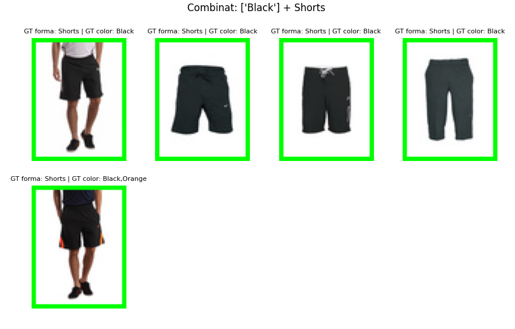
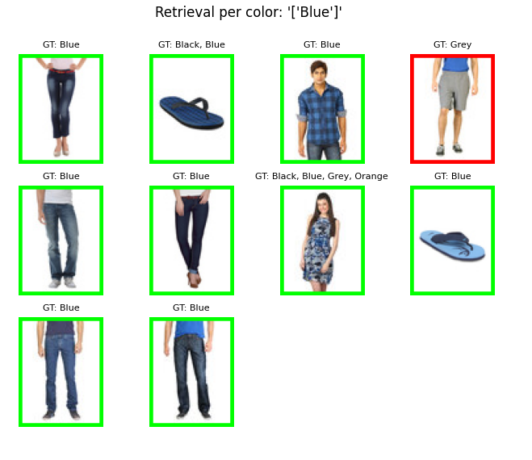
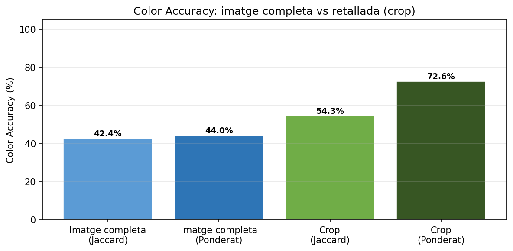
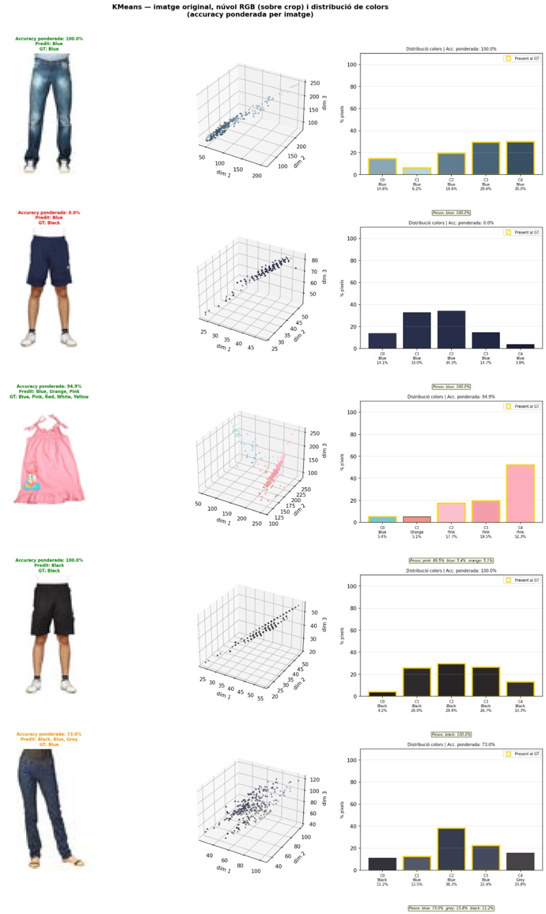
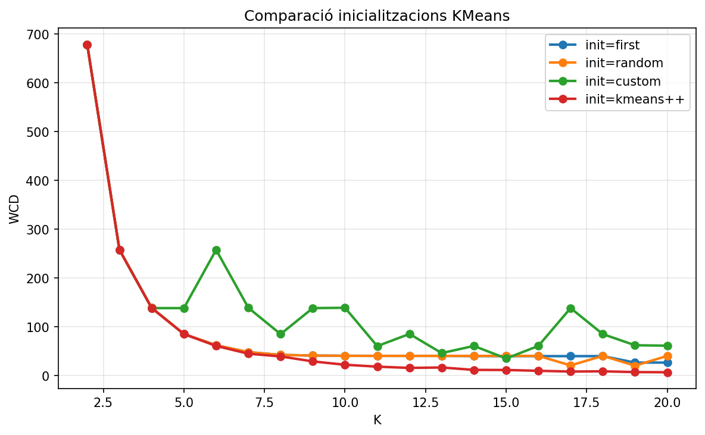
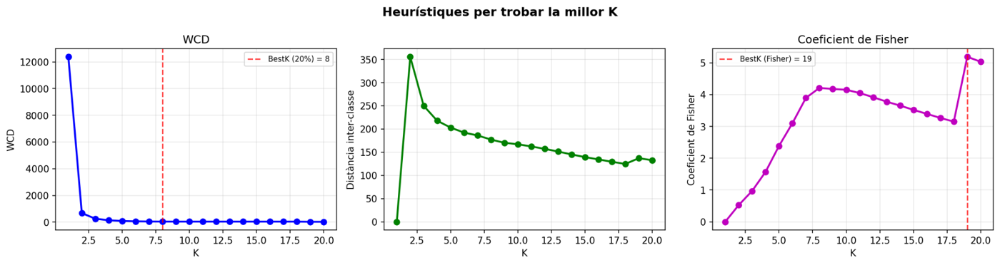
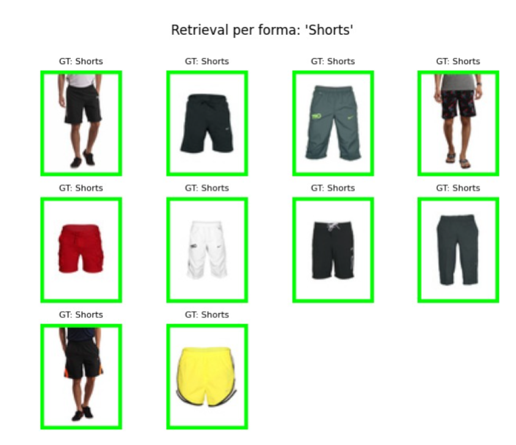
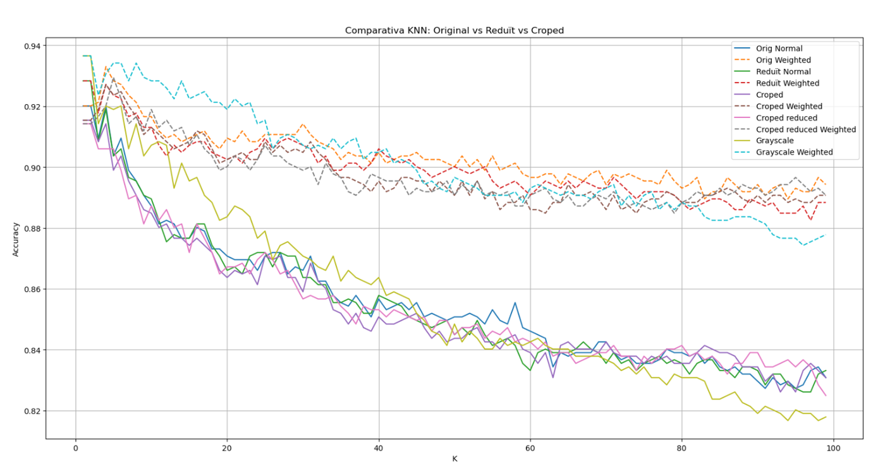

# Etiquetatge automàtic de roba amb K-Means i KNN

<p align="center">
  
</p>

Projecte de l'assignatura **Intel·ligència Artificial** (Enginyeria Informàtica). El sistema analitza imatges de peces de roba i n'extreu dues etiquetes:

- **Color** (o colors) predominant, amb **K-Means** (aprenentatge no supervisat) sobre els píxels en l'espai RGB.
- **Forma / tipus de peça** (samarreta, pantalons, sabates...), amb **KNN** (aprenentatge supervisat) sobre les imatges en escala de grisos.

Combinant les dues etiquetes es poden fer cerques com *"pantalons curts negres"*, com a base d'un sistema de cerca i recuperació d'imatges. Els dos algorismes s'han implementat des de zero amb NumPy.

## Resultats destacats

| | Resultat |
|---|---|
| KNN, millor precisió de forma | **≈ 93,7 %** (escala de grisos amb normalització Z-score) |
| KNN amb K = 99 | 87,8 % amb vot ponderat vs. ≈ 82 % amb vot majoritari |
| KNN amb resolució reduïda | Fins a **4× més ràpid** sense perdre precisió |
| K-Means, encert de color (ponderat) | **44,0 % → 72,6 %** retallant el fons blanc |
| K-Means, inicialització | `kmeans++` dona la WCD més baixa per a tots els valors de K |

## Color amb K-Means

Cada imatge es retalla per eliminar el fons blanc (coordenades de `gt_reduced.json`), s'agrupen els píxels en K clústers i cada centroide es tradueix a una de les 11 etiquetes de color (Blue, Black, Grey...) segons la probabilitat de pertinença.

<p align="center">
  
  
</p>

El retall del fons és la millora amb més impacte: a la imatge completa el blanc del fons sovint era el color majoritari i distorsionava l'etiquetatge.

<p align="center">
  
</p>

Per a cada imatge es visualitza el núvol de píxels en 3D acolorit pel clúster assignat i la distribució de colors predits (en groc, els presents al ground truth). Hi apareixen encerts clars i també limitacions, com la confusió entre negre i blau fosc.

### Millores en K-Means

- **Inicialització dels centroides**: s'han comparat `first`, `random`, `custom` (uniforme a l'espai RGB) i `kmeans++`. `kmeans++` obté la WCD més baixa i estable; `custom` cau en mínims locals.
- **Elecció de K** (`find_bestK`): a més del criteri de colze sobre la WCD (llindar del 20 %), s'han provat la distància inter-classe i el coeficient de Fisher. Per a roba, un llindar entre el 15 % i el 20 % dona valors de K realistes.

<p align="center">
  
</p>

<p align="center">
  
</p>

## Forma amb KNN

Cada imatge de test es compara amb les 7.500 del conjunt d'entrenament i la classe s'assigna per votació entre els K veïns més propers.

<p align="center">
  
</p>

### Millores en KNN

- **Vot ponderat per distància** (`w = 1/(d+ε)`): els veïns propers pesen més, i la precisió es degrada molt menys quan K creix.
- **Reducció de dimensionalitat**: el retall de marges (14.400 → 10.500 píxels) gairebé no afecta la precisió, i reduir la resolució a 3.600 píxels actua com a filtre de soroll i accelera fins a 4×.
- **Normalització Z-score de la il·luminació**: elimina la dependència de la brillantor absoluta i dona el model més precís per a K baixes i moderades.
- **Espais de característiques alternatius**: HOG simplificat, imatge redimensionada a 15×20 i descriptors estadístics. Els píxels en brut guanyen, però el 15×20 en queda a prop amb només 300 valors.

<p align="center">
  
</p>

## Estructura del repositori

```
├── src/
│   ├── Kmeans.py                    # Implementació de K-Means i get_colors
│   ├── KNN.py                       # Implementació de KNN
│   ├── improvments_knn_definitiu.py # Millores i mètriques de KNN
│   ├── improvments_knn_original.py  # Versió prèvia de les millores
│   ├── utils.py, utils_data.py      # Conversió de color, lectura del dataset i visualització
│   ├── TestCases_kmeans.py          # Tests unitaris de K-Means
│   ├── TestCases_knn.py             # Tests unitaris de KNN
│   └── practice/                    # Scripts de prova
├── images/
│   ├── train/, test/                # Dataset (7.500 + 1.394 imatges)
│   └── gt_reduced.json              # Ground truth amb coordenades de retall
├── test/                            # Ground truth i casos de test (.pkl)
└── docs/img/                        # Imatges d'aquest README
```

## Execució

Requisits: Python 3, `numpy`, `scipy`, `matplotlib` i `Pillow`.

```bash
pip install numpy scipy matplotlib pillow

# Tests unitaris (des de l'arrel del repositori)
python src/TestCases_kmeans.py
python src/TestCases_knn.py

# Experiments de millora del KNN (des de src/)
cd src
python improvments_knn_definitiu.py
```

## Autors

- Guillem Simon Rodriguez
- Oriol Sanchez Romero
- Joan Soldevila Villalba

Maig de 2026.
